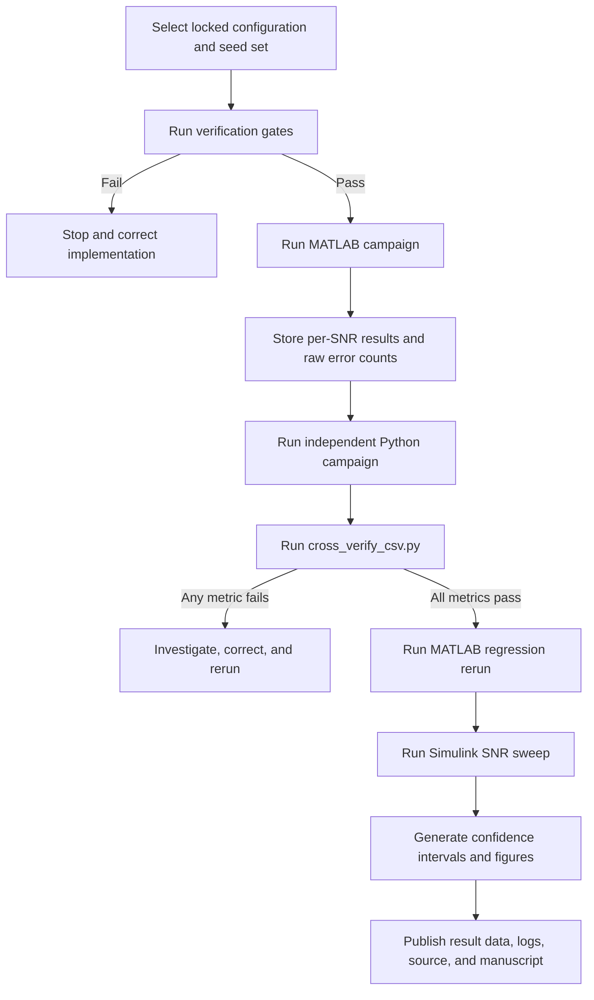

# Design, Cross-Verification, and Statistically Qualified Performance Evaluation of a PDSCH-Oriented 5G NR Massive MIMO-OFDM Physical-Layer Link-Level and Simulink**

**Design, cross-verification, and statistically qualified performance evaluation using MATLAB, Python, and Simulink**

This repository contains a research-grade physical-layer link-level simulation platform for a PDSCH-oriented 5G New Radio (NR) Massive MIMO-OFDM downlink. The project connects the complete simulation chain—from transport-block generation and channel coding to MIMO detection, CRC-based block decisions, statistical qualification, and waveform-domain analysis—with a formal verification and reproducibility workflow.

The primary implementation is developed in **MATLAB**. An independently written **Python** reference implementation reproduces the uncoded, CRC-protected processing chain for cross-verification, while a **Simulink** testbench executes the verified MATLAB functions in a third environment.

> **Scope:** This is a link-level digital-baseband research simulator. It is not a complete gNB/UE protocol stack or a 3GPP conformance-test implementation.

---
## Table of Contents

- [Project Objectives](#project-objectives)
- [Main Contributions](#main-contributions)
- [System Architecture](#system-architecture)
- [Implemented Physical-Layer Functions](#implemented-physical-layer-functions)
- [Mathematical Signal Model](#mathematical-signal-model)
- [Simulation Profiles](#simulation-profiles)
- [Verification Methodology](#verification-methodology)
- [Statistical Qualification](#statistical-qualification)
- [Key Results](#key-results)
- [Repository Structure](#repository-structure)
- [Software Requirements](#software-requirements)
- [Getting Started](#getting-started)
- [Recommended Execution Workflow](#recommended-execution-workflow)
- [Result Files and Reproducibility](#result-files-and-reproducibility)
- [Limitations](#limitations)
- [Planned Extensions](#planned-extensions)
- [Associated Manuscript](#associated-manuscript)
- [Citation](#citation)
- [Author](#author)

---

## Project Objectives

The project was developed to address two common weaknesses in physical-layer simulation studies:

1. **Implementation correctness** — BER, BLER, EVM, NMSE, throughput, and capacity curves are meaningful only when modulation scaling, OFDM normalization, SNR calibration, channel estimation, equalization, and CRC processing have been verified.
2. **Statistical reliability** — finite Monte Carlo simulations should report confidence intervals, raw error counts, stopping conditions, and upper confidence bounds for zero-error operating points instead of presenting unsupported zero BER or zero BLER values.

The platform therefore combines a complete PDSCH-oriented simulation chain with:

- pre-campaign verification gates;
- comparison against closed-form analytical references;
- MATLAB–Python cross-verification under explicit tolerances;
- Simulink regression execution;
- adaptive Monte Carlo stopping;
- exact Clopper–Pearson 95% confidence intervals;
- fixed and recorded random seeds;
- stored per-SNR result files and configuration logs;
- traceability from equations to implementation functions and result figures.

---

## Main Contributions

### 1. End-to-end PDSCH-oriented link simulator

The MATLAB implementation covers:

- transport-block generation;
- CRC-24A attachment and checking;
- TS 38.212 LDPC encoding, rate matching, decoding, and rate recovery;
- NR Gold-sequence scrambling and descrambling;
- QPSK, 16-QAM, 64-QAM, and 256-QAM;
- spatial-layer mapping;
- DM-RS insertion;
- wideband eigenbeamforming precoding;
- CP-OFDM modulation and demodulation;
- AWGN, Rayleigh, Rician, and tapped-delay-line channel models;
- DM-RS-based least-squares effective-channel estimation;
- ZF and unbiased-MMSE MIMO equalization;
- hard and max-log soft demodulation;
- CRC-based transport-block decisions;
- BER, BLER, EVM, NMSE, SINR, throughput, spectral efficiency, and capacity evaluation;
- waveform PSD, constellation, and PAPR analysis.

### 2. Three aligned execution environments

| Environment | Scope | Main role |
|---|---|---|
| MATLAB | Complete coded and uncoded simulator | Primary implementation and result generation |
| Python | Independent uncoded, CRC-protected reference chain | Cross-verification of algorithms and metrics |
| Simulink | Testbench around the verified MATLAB functions | Third-environment regression and waveform instrumentation |

The MATLAB and Python codebases are independently written and share the same mathematical specification rather than the same source code.

### 3. Verification before performance evaluation

A simulation campaign is accepted only after the required verification gates pass. These gates cover constellation power, modulation round trips, OFDM reconstruction, CRC behavior, coded-chain operation, analytical BER references, and capacity identities.

### 4. Statistically qualified Monte Carlo results

Every reported BER and BLER operating point is tied to:

- executed bit or block count;
- raw error count;
- exact 95% confidence interval;
- stopping reason;
- random seed;
- configuration record;
- wall-clock runtime where applicable.

Zero recorded errors are reported as upper confidence bounds, not as an error rate of zero.

---

## System Architecture


For the uncoded MATLAB–Python comparison chain, the LDPC stages are bypassed while CRC protection, scrambling, modulation, MIMO processing, channel estimation, equalization, and metric extraction remain active.

---

## Implemented Physical-Layer Functions

### Transmitter

- CRC-24A generation
- TS 38.212 DL-SCH/LDPC processing in MATLAB
- Gold-sequence scrambling
- Unit-average-power QAM mapping
- Multi-layer symbol mapping
- PDSCH-oriented resource-grid construction
- Two DM-RS symbols per slot
- Wideband SVD/eigenbeamforming precoding
- CP-OFDM waveform generation

### Channel

- AWGN
- Flat i.i.d. Rayleigh fading
- Rician fading
- Frequency-selective tapped-delay-line channels
- Independent channel realization per Monte Carlo frame
- Explicit total-transmit-SNR normalization

### Receiver

- CP removal and FFT processing
- DM-RS extraction
- LS estimation of the effective layer channel
- Two-DM-RS-symbol averaging
- Frequency interpolation with nearest-pilot edge extension
- Ideal-CSI reference mode
- ZF equalization
- MMSE equalization
- Diagonal debiasing for unbiased-MMSE symbol estimates
- Hard-decision detection for uncoded campaigns
- Max-log LLR generation for coded campaigns
- LDPC decoding and CRC-based transport-block decisions

### Metrics

- Bit error rate (BER)
- Block error rate (BLER)
- RMS error vector magnitude (EVM)
- Channel-estimation normalized mean-square error (NMSE)
- Post-equalization SINR
- Throughput
- Spectral efficiency
- MIMO capacity reference
- Power spectral density
- Peak-to-average power ratio CCDF

---

## Mathematical Signal Model

For subcarrier `k` and OFDM symbol `m`, the precoded MIMO link is modeled as

$$
\mathbf{y}[k,m] = \mathbf{H}[k,m]\mathbf{W}[k,m]\mathbf{s}[k,m] + \mathbf{n}[k,m],
$$

where:

- $\mathbf{s}[k,m] \in \mathbb{C}^{L\times1}$ is the spatial-layer symbol vector;
- $\mathbf{W}[k,m] \in \mathbb{C}^{N_T\times L}$ is the precoder;
- $\mathbf{H}[k,m] \in \mathbb{C}^{N_R\times N_T}$ is the MIMO channel;
- $\mathbf{n}[k,m]$ is the receiver-noise vector;
- $L$ is the number of spatial layers.

The receiver estimates and equalizes the **effective layer channel**

$$
\mathbf{G}[k,m] = \mathbf{H}[k,m]\mathbf{W}[k,m].
$$

### Power and SNR normalization

All QAM constellations are normalized to unit average symbol power. The precoder columns are orthonormal, so the total transmitted power is equal to the layer count:

$$
\mathbb{E}\{\|\mathbf{W}\mathbf{s}\|^2\}=L.
$$

For total transmit SNR $\rho$, the noise variance per receive antenna is

$$
\sigma_n^2 = L\cdot 10^{-\mathrm{SNR}_{\mathrm{dB}}/10}.
$$

This convention ensures that antenna-configuration comparisons are performed at equal total transmit power.

### Wideband eigenbeamforming

The default precoder is computed from the average transmit covariance over the active subcarriers:

$$
\mathbf{R}=\frac{1}{K}\sum_{k=1}^{K}\mathbf{H}^{H}[k]\mathbf{H}[k].
$$

The $L$ dominant eigenvectors of $\mathbf{R}$ form the precoder. A single wideband matrix is used over all subcarriers, which preserves the frequency smoothness required by DM-RS interpolation.

### DM-RS-based LS estimation

At a DM-RS resource element,

$$
\widehat{\mathbf{G}}_{\mathrm{LS}}[k,m]
= \frac{\mathbf{Y}_{\mathrm{DMRS}}[k,m]}{r[k,m]}.
$$

The two DM-RS-symbol estimates are averaged and then interpolated over frequency. Outside the outer pilot positions, the nearest pilot estimate is extended to the edge subcarriers.

### Linear equalization

The ZF equalizer is

$$
\mathbf{F}_{\mathrm{ZF}}
=\left(\widehat{\mathbf{G}}^{H}\widehat{\mathbf{G}}\right)^{-1}
\widehat{\mathbf{G}}^{H}.
$$

The MMSE equalizer is

$$
\mathbf{F}_{\mathrm{MMSE}}
=\left(\widehat{\mathbf{G}}^{H}\widehat{\mathbf{G}}+\sigma_n^2\mathbf{I}\right)^{-1}
\widehat{\mathbf{G}}^{H}.
$$

The raw MMSE output is normalized by the diagonal of $\mathbf{F}\widehat{\mathbf{G}}$ to remove amplitude bias before QAM decisions.

---

## Simulation Profiles

### Massive MIMO profile

| Parameter | Executed value |
|---|---|
| Active allocation | 12 RB, 144 active subcarriers |
| FFT size | 256 |
| Subcarrier spacing | 30 kHz |
| Slot | 14 OFDM symbols, 0.5 ms |
| Occupied bandwidth | 4.32 MHz |
| Sample rate | 7.68 MHz |
| Antennas | 64 transmit, 8 receive |
| Spatial layers | 4 |
| Modulation | 16-QAM |
| Precoder | Wideband eigenbeamforming |
| Channel | Flat i.i.d. Rayleigh for the principal massive campaign |
| Channel estimation | Two-symbol averaged LS with frequency interpolation |
| Equalizer | Unbiased MMSE |
| Payload | 27,624 information bits per slot in the uncoded CRC-protected campaign |
| SNR grid | −10 to 20 dB in 5 dB steps |
| Monte Carlo rule | 500–20,000 frames per SNR point |

### Compact frequency-selective profile

| Parameter | Executed value |
|---|---|
| Antennas | 4 transmit, 4 receive |
| Spatial layers | 2 |
| Modulation | 16-QAM |
| Channel | Five-tap TDL frequency-selective channel |
| Precoder | SVD/wideband eigenbeamforming configuration |
| Estimation | DM-RS LS estimation and interpolation |
| Equalizer | MMSE/unbiased-MMSE |
| SNR grid | 0 to 25 dB |
| Frames | 40 per SNR point for the uncoded campaign |
| Evaluated bits | 598,080 per SNR point |

### LDPC-coded profile

The coded campaigns use the compact 4×4, two-layer, 16-QAM TDL profile with three target code rates:

| Target code rate | Transport-block payload | Fine-grid cliff SNR | Measured cliff BLER | Throughput plateau |
|---:|---:|---:|---:|---:|
| 0.30 | 4,480 bits | 2.5 dB | 0.300 | 8.960 Mbit/s |
| 0.48 | 7,168 bits | 5.0 dB | 0.600 | 14.336 Mbit/s |
| 0.75 | 11,272 bits | 10.0 dB | 0.660 | 22.544 Mbit/s |

The reported throughputs correspond to the executed 12-RB, 0.5-ms-slot allocation and are not extrapolated to wider bandwidths.

---

## Verification Methodology

The central acceptance rule is:

> A numerical result is accepted only when it was produced by the executed simulator, all required verification gates passed, and the result was stored with its configuration, seed, source, output data, and verification record.

### Pre-campaign gates

- Exact average power of QPSK, 16-QAM, 64-QAM, and 256-QAM constellations
- Error-free noiseless modulation/demodulation round trip
- Unitary OFDM modulation/demodulation round trip
- CRC acceptance of valid blocks
- CRC rejection of corrupted blocks
- Error-free noiseless LDPC coded-chain round trip
- Correct max-log LLR sign convention
- Successful high-SNR LDPC decode

The measured OFDM round-trip relative reconstruction error is approximately `1.19e-15`, which is at double-precision numerical accuracy.

### Closed-form anchoring

The simulator is checked against:

- analytical QPSK and 16-QAM BER in AWGN;
- analytical QPSK BER in flat Rayleigh fading;
- an exact identity-channel MIMO capacity reference.

The ideal-CSI QPSK AWGN deviations at 4, 6, and 8 dB are approximately `0.007`, `0.005`, and `0.007` logarithmic decades.

### MATLAB–Python tolerance protocol

| Metric | Comparison rule | Acceptance tolerance |
|---|---|---:|
| BER | Absolute logarithmic-decade difference | 0.30 decades |
| NMSE | Absolute logarithmic-decade difference | 0.15 decades |
| EVM | Relative difference | 10% |
| Capacity | Relative difference | 2% |
| BLER | Absolute difference | 0.25 |

Any failed comparison is treated as a defect until it is corrected or explained statistically and the campaign is re-executed.

### Defect-detection example

The cross-verification process detected an inconsistent interpolation-edge rule between the MATLAB and Python implementations. A paired common-input experiment localized the discrepancy to six edge subcarriers. After both implementations adopted nearest-pilot edge extension, the maximum BER deviation decreased from `0.27` to `0.046` logarithmic decades.

---

## Statistical Qualification

### Exact confidence intervals

BER and BLER are treated as binomial proportions. Every result includes an exact two-sided Clopper–Pearson 95% confidence interval derived from the executed error count and number of trials.

### Zero-error points

A zero observed error count is not reported as BER = 0 or BLER = 0. Instead, the simulator reports an upper confidence bound. For example:

- `0` bit errors in `552,480,000` evaluated bits gives `BER < 6.64e-9` at 95% confidence;
- `0` block errors in `20,000` blocks gives `BLER < 1.9e-4` at 95% confidence.

### Adaptive stopping

For the principal massive-MIMO campaign, each SNR point runs until one of the following conditions is met:

- at least 500 bit errors;
- at least 100 block errors;
- maximum budget of 20,000 frames;
- minimum budget of 500 frames.

Each result row stores the frame count, bit count, raw errors, confidence interval, stopping reason, random seed, and runtime.

---

## Key Results

### Cross-verification and regression

- **MATLAB–Python massive profile:** 35 of 35 metric comparisons passed.
- **Largest MATLAB–Python deviation:** 0.046 logarithmic decades in BER at the 10 dB cliff point.
- **Compact 4×4 TDL profile:** all MATLAB–Python comparisons passed at all six SNR points.
- **MATLAB rerun regression:** all points remained within tolerance.
- **Simulink sweep:** all 7 SNR grid points passed.
- **Worst Simulink BER deviation:** 0.009 logarithmic decades.

### Massive-array and eigenbeamforming result

Under equal total transmit power, ideal effective CSI, four layers, 16-QAM, and flat i.i.d. Rayleigh fading:

- the unprecoded 4×4 reference and eigenbeamformed 64×8 profile show a measured horizontal separation of **19.6 dB at BER = 10⁻¹**;
- this value is a **combined antenna-dimension and eigenbeamforming gain**, not a pure precoding gain;
- the result is specific to the stated channel, antenna dimensions, CSI assumption, layer count, and BER operating point.

### Principal 64×8 adaptive campaign

| SNR | Frames | Evaluated bits | BER | BLER |
|---:|---:|---:|---:|---:|
| −10 dB | 500 | 13.8 M | 3.372e-1 | 1.000 |
| −5 dB | 500 | 13.8 M | 1.928e-1 | 1.000 |
| 0 dB | 500 | 13.8 M | 7.315e-2 | 1.000 |
| 5 dB | 500 | 13.8 M | 8.372e-3 | 1.000 |
| 10 dB | 500 | 13.8 M | 4.308e-5 | 0.632 |
| 15 dB | 20,000 | 552.5 M | < 6.64e-9 | < 1.9e-4 |
| 20 dB | 20,000 | 552.5 M | < 6.64e-9 | < 1.9e-4 |

Additional observations:

- NMSE decreases from approximately `1.34` at −10 dB to `1.35e-3` at 20 dB.
- RMS EVM decreases from approximately `84.4%` to `3.4%`.
- The uncoded BLER cliff occurs when BER approaches the inverse of the 27,624-bit block size.

### Compact 4×4 frequency-selective campaign

- BER decreases from `2.73e-1` at 0 dB to `3.53e-4` at 25 dB.
- NMSE decreases from `4.76e-1` to `4.19e-3`.
- RMS EVM decreases from `80.1%` to `7.6%`.
- Uncoded throughput reaches approximately `2.99 Mbit/s` at 20 dB and `5.23 Mbit/s` at 25 dB.

### Capacity scaling

At 25 dB, the measured ergodic MIMO-capacity references are approximately:

| Configuration | Capacity |
|---|---:|
| 2×2 | 14 bit/s/Hz |
| 4×4 | 28 bit/s/Hz |
| 8×8 | 56 bit/s/Hz |
| 64×8 | 66 bit/s/Hz |

The 64×8 profile has the same high-SNR multiplexing slope as the 8×8 profile because both have minimum antenna dimension eight, while the vertical offset represents transmit-array gain.

### LDPC results

- All three code rates form rate-ordered BLER waterfalls.
- The strongest code approximately closes the link 20 dB earlier than the uncoded reference in the executed compact profile.
- The throughput curves saturate exactly at the transport-block-size-per-slot plateaus.
- Intermediate throughput points satisfy `Throughput = Plateau × (1 − BLER)`.

### Waveform-domain results

- Occupied bandwidth: approximately `4.32 MHz` within a `7.68 MHz` sampled band.
- In-band PSD ripple: approximately 1 dB.
- CP-OFDM out-of-band sidelobes: approximately 28 dB below the in-band level.
- PAPR exceeds approximately 9 dB for 10% of OFDM symbol waveforms.
- PAPR exceeds approximately 10.3 dB for 1% of symbol waveforms.
- Worst observed PAPR: approximately 11.7 dB.

---

## Repository Structure

The following structure is recommended for uploading the complete reproducibility package:

```text
.
├── Matlab File/
│   ├── core/                    # Transmitter, channel, receiver, and metric functions
│   ├── campaigns/               # Compact, massive-MIMO, theory, and LDPC drivers
│   ├── verification/            # Pre-campaign verification gates
│   ├── plotting/                # Figure-regeneration scripts
│   ├── results/                 # MATLAB CSV/MAT result files
│   └── config.m                 # Locked MATLAB configuration
│
├── Python File/
│   ├── core/                    # Independent uncoded reference modules
│   ├── campaigns/               # Python campaign drivers
│   ├── verification/            # Python checks and cross-verification tools
│   ├── plotting/                # Python figure-regeneration scripts
│   ├── results/                 # Python CSV result files and raw error counts
│   ├── config.py                # Locked Python configuration
│   ├── cross_verify_csv.py      # MATLAB–Python metric comparison
│   ├── requirements.txt
│   └── pyproject.toml
│
├── Simulink File/
│   ├── model/                   # Simulink testbench
│   ├── build/                   # Model-generation/build scripts
│   ├── wrappers/                # MATLAB Function block wrappers
│   └── results/                 # Simulink sweep and instrument logs
│
├── Results/
│   ├── cross_verification/      # Persistent PASS/FAIL records
│   ├── confidence_intervals/    # Raw counts and exact interval outputs
│   ├── waveform/                # PSD, constellation, and PAPR data
│   └── figures/                 # Regenerated publication figures
│
├── Report/
│   └── Journal_Manuscript_v5_5G_NR_Massive_MIMO_Simulator.docx
│
├── LICENSE
├── CITATION.cff
└── README.md
```

The exact folder names can be adjusted, but the source code, locked configurations, seeds, result data, verification records, plotting scripts, and manuscript should remain clearly separated.

---

## Software Requirements

### MATLAB implementation

Recommended MathWorks products:

- MATLAB
- Communications Toolbox
- 5G Toolbox for the TS 38.212 DL-SCH/LDPC coded campaigns
- Simulink
- DSP System Toolbox for Spectrum Analyzer and related instrumentation
- Communications Toolbox support for Constellation Diagram instrumentation, depending on release

The uncoded baseband functions may use fewer toolboxes, while the coded and instrumented workflows require the relevant products above.

### Python reference implementation

The Python package is based on NumPy and SciPy. Install the exact package versions recorded in the repository manifests:

```bash
python -m venv .venv

# Windows
.venv\Scripts\activate

# Linux/macOS
source .venv/bin/activate

python -m pip install --upgrade pip
python -m pip install -r "Python File/requirements.txt"
```

The repository should retain both `requirements.txt` and `pyproject.toml` so that the environment used for cross-verification can be reproduced.

---

## Getting Started

### 1. Clone the repository

```bash
git clone https://github.com/dipucwc/wireless-system-simulation-validation.git
cd wireless-system-simulation-validation
```

### 2. Run the MATLAB verification gates

Open MATLAB in the repository root and add the MATLAB package recursively:

```matlab
cd('Matlab File')
addpath(genpath(pwd))
```

Run the provided verification driver before starting any campaign. The driver should stop execution if any constellation-power, modulation, OFDM, CRC, analytical-reference, or coded-chain gate fails.

### 3. Run the MATLAB campaigns

Execute the required campaign driver from the `Matlab File/campaigns/` directory. The coded TS 38.212 campaign is implemented by:

```matlab
run_ldpc_campaign
```

Run compact and massive-MIMO campaign drivers using the locked configuration and seed files supplied with the repository. Preserve the generated CSV/MAT files because the figures and cross-verification records are regenerated from these outputs.

### 4. Run the Python reference

From the repository root:

```bash
python "Python File/main.py"
```

The Python execution should use the same locked system configuration as the MATLAB uncoded campaign while retaining an independent random stream.

### 5. Run MATLAB–Python cross-verification

After both implementations have written their per-SNR CSV files:

```bash
python "Python File/cross_verify_csv.py"
```

The comparison output should include, for every SNR and metric:

- MATLAB value;
- Python value;
- deviation;
- allowed tolerance;
- PASS/FAIL verdict.

The campaign is accepted only when every required comparison passes.

### 6. Run the Simulink testbench

1. Open the `.slx` model under `Simulink File/model/`.
2. Run the model initialization or build script.
3. Confirm that the locked 64×8, four-layer dimensions are loaded.
4. Confirm that the verification gates pass before the first simulation step.
5. Execute the seven-point SNR sweep.
6. Save the sweep comparison record, transmitted waveform log, and equalized-symbol log.

The testbench advances one complete Monte Carlo frame per simulation step and uses passive monitoring branches for the Spectrum Analyzer and Constellation Diagram.

---

## Recommended Execution Workflow



---

## Result Files and Reproducibility

Every accepted figure or table should be regenerable from a stored artifact set containing:

1. locked simulation configuration;
2. recorded random seed;
3. executed source version;
4. per-SNR numerical result file;
5. passed verification record.

Recommended fields for every result row include:

```text
snr_db
frames
payload_bits_per_frame
total_bits
bit_errors
block_errors
ber
ber_ci_low
ber_ci_high
bler
bler_ci_low
bler_ci_high
evm_rms
nmse
sinr_db
throughput_bps
capacity_bps_hz
stopping_reason
seed
runtime_seconds
```

For zero-error rows, retain the raw zero count and store the calculated upper confidence bound separately. Do not replace the measured row with a numerical zero on logarithmic BER or BLER plots.

---

## Computational Cost

For the 64×8 profile, the principal computational cost comes from forming the transmit covariance and performing the 64-dimensional eigendecomposition once per frame.

Representative MATLAB runtime from the executed campaign:

- approximately `0.18 s/frame`;
- approximately `86–91 s` for a 500-frame SNR point;
- approximately `3,813–3,867 s` for a 20,000-frame SNR point;
- approximately `2 h 14 min` for the full seven-point adaptive campaign on the executing workstation.

Runtime depends strongly on processor, MATLAB release, BLAS implementation, parallel settings, and whether plots or Simulink instruments are active.

---

## Limitations

The current conclusions are intentionally limited to the modeled conditions:

- digital complex-baseband link-level simulation;
- single-cell, single-user downlink;
- ideal timing and frequency synchronization;
- no MAC scheduling or HARQ timing;
- no higher-layer protocol procedures;
- no RF impairments in the verified core;
- flat i.i.d. Rayleigh fading for the headline 64×8 result;
- no spatial correlation or explicit ULA/UPA geometry in that headline comparison;
- ideal transmitter CSI for precoder computation;
- reduced 12-RB allocation;
- Python reference limited to the uncoded CRC-protected chain;
- cross-verification performed statistically at the metric level, except for the documented paired-input defect investigation.

The 19.6 dB result should therefore not be interpreted as a universal deployed-network massive-MIMO gain.

---

## Planned Extensions

- TDL-A and TDL-C evaluation over several delay spreads
- Line-of-sight and Rician scenarios
- Spatially correlated ULA/UPA channel models
- Explicit antenna geometry and element spacing
- Low- and moderate-Doppler evaluation
- Delayed or noisy transmitter CSI
- Noisy covariance estimation
- Codebook and quantized precoding
- Wideband versus subband and per-subcarrier SVD comparison
- LS versus LMMSE-smoothed channel estimation
- Raw MMSE versus unbiased MMSE comparison
- DM-RS density and interpolation ablation studies
- Systematic sample-level MATLAB–Python checkpoint tests
- External benchmarking against a matched MATLAB 5G Toolbox reference configuration
- Runtime and complexity scaling across antenna dimensions
- Phase noise, IQ imbalance, and power-amplifier nonlinearity
- RF-aware analysis based on the measured PAPR distribution
- Learning-based estimation and detection benchmarked against the verified LS, ZF, and MMSE baselines

--

---

## License

See the repository [LICENSE](LICENSE) file for the applicable software and documentation terms.

---

## Author

**Md Moklesur Rahman**  
Independent Researcher, Finland  
GitHub: [dipucwc](https://github.com/dipucwc)  
Email: moklesur.eee@gmail.com

---

## Keywords

`5G NR` · `PDSCH` · `Massive MIMO` · `MIMO-OFDM` · `Link-Level Simulation` · `LDPC` · `DM-RS` · `Channel Estimation` · `Wideband SVD` · `Eigenbeamforming` · `ZF` · `MMSE` · `BER` · `BLER` · `EVM` · `NMSE` · `Monte Carlo` · `Clopper-Pearson Confidence Interval` · `MATLAB` · `Python` · `Simulink`
